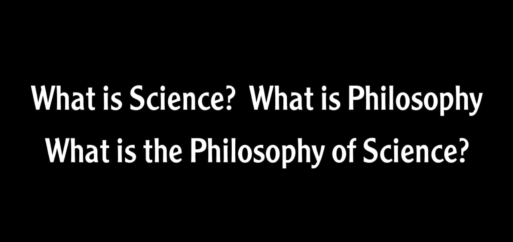

# فلسفة العلم؟

أي علم(مقرر) بتتعلمه **بتطبيقاته** فقط متعرفش هو اتعمل ليه؟ وتاريخه أيه؟ وفلسفة العلم أيه؟ فأنت يعتبر متعلمتش (**مفهمتش فهم حقيقي**) حاجة عن العلم.    

# لماذا فلسفة العلم؟
مقررات كتير هتدرسها **ومش هتبقى عارف ليه بتدرسها** ومحتاج حافز يفهمك نبذة عن العلم أو بمعنى تاني **فلسفة العلم** عشان تقدر تلمس فعلاً تطبيقات المقرر دا على أرض الواقع وأهميته أيه؟ وعلاقتك مع المقرر هتبقى أكبر من امتحان أكاديمي في أخر السنة وشوية كويزات.  

# كيف؟
ببساطة قبل الشروع في تعلم أي شيء عليك بمعرفة نبذة عامة عن هذا العلم وهذا لن يحتاج منك إلا **جهداً بسيطاً جداً** في تحصيل ثقافة عامة (المحطات الكبيرة) في هذا المقرر لمعرفة فلسفته وتاريخه ولماذا وجد وتطبيقاته، وأثناء التعلم قم بتكرار هذه العملية.

# تجربة شخصية
في فصلي الدراسي الأول في تخصص علوم الحاسب درست مقرر `تصميم وتحليل الخوارزميات` وجدت صعوبة في فهم غايته وملامسة واقع تطبيقاته، كان عبارة عن **بعض المشاكل وطرق حلها** فقط كنت أكتفي بحفظ طرق الحل(محاولة) وأرحل! ذهبت إلى الامتحان ونسيت ما يزيد عن عشرين خوارزمية! ولم أتذكر حلول متداخلة مع بعضها البعض والقليل من السطور الواضحة السليمة.   
   
في الفصل الصيفي بذلت **جهداً بسيطاً جداً** في معرفة فلسفة هذا المقرر **ومحاولة** تحويل كل ما هو نظري مُجرد إلى حقيقة وهذا غير الكثير في رؤيتي للعلوم بشكل عام وأن بداية تعلم أي علم تبدأ من تحفيز العقل **والإجابة على لماذا.**

# هام
فلسفة العلوم تعكس الكثير من وجهات النظر `الشخصية` فعليك الحذر من الأفكار الإلحادية وإزالة تلك السموم من العلم.     
هذا فيديو قصير يوضح هذه النقطة https://youtu.be/8UlkjXakRjI 
