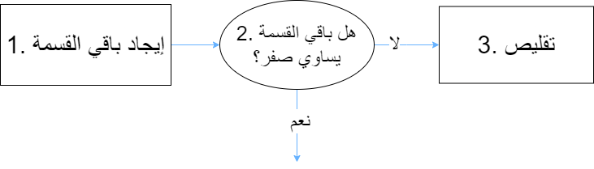

# الأصل؟
مصطلح **الخوارزمية** جاء من اسم العالم ابو عبد الله محمد ابن موسى **الخوارزمي**.                              

# التعريف
هي مجموعة من الخطوات الرياضية والمنطقية والمتسلسلة اللازمة **لحل مشكلة ما**.
# مثال: خوارزمية إقليدس
الوصف: لدينا عددان طبيعيان `س` و`ص`، أوجد القاسم المشترك الأكبر لهم، **أي أكبر عدد طبيعي الذي يقسم `س` و`ص` معاً من دون أي باقٍ من القسمة**.   
### الخوازرمية
1. نقسم `س` على `ص`، ونرمز لباقي القسمة بـ `ب`، حيث **ص => ب  => 0**.
2. لو `ب` = 0، تنتهي الخوازرمية و الناتج هو `ص`.
3. نضع `س` &rarr; `ص` و`ص` &rarr; `ب`، ثم نذهب للخطوة رقم 1.

